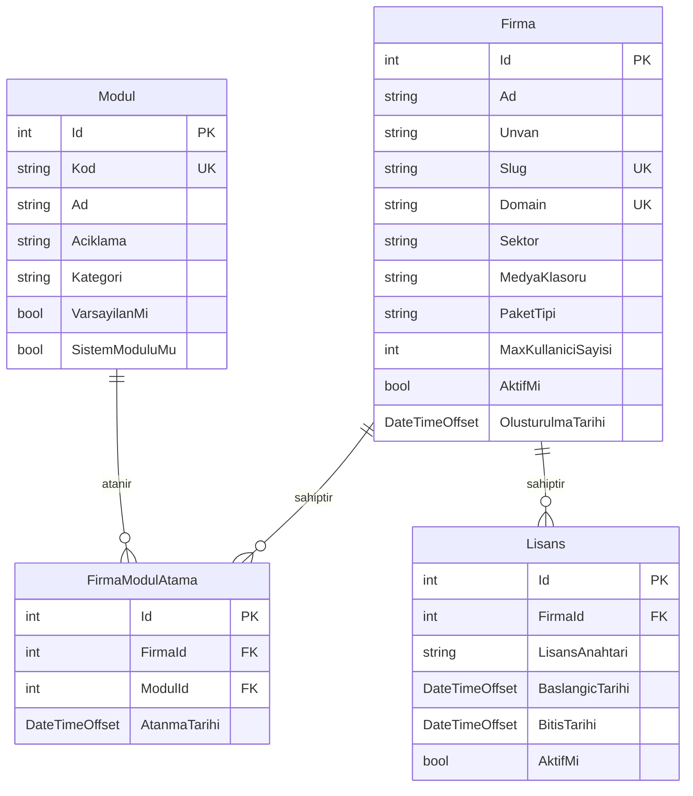

# 🚀 VizitLink3D — Çoklu Firma (Multi-Tenant SaaS) Dönüşüm ve Görev Planı (coklufirma.md)

> **Proje Markası:** VizitLink3D  
> **Mimari Hedef:** Tam Bağımsız SuperAdmin + Firma Başına Ayrı SQLite Veritabanı + Sadece JSON Dil Sistemi + Domain Tabanlı Tenant Tespiti  
> **Tarih:** 6 Ağustos 2026  

---

## 📌 İÇİNDEKİLER
1. [Mimari Özet ve Temel Kararlar](#1-mimari-özet-ve-temel-kararlar)
2. [Veritabanı Şeması ve Modeller](#2-veritabanı-şeması-ve-modeller)
3. [Projeler ve Klasör Haritası](#3-projeler-ve-klasör-haritası)
4. [Faz Bazlı Detaylı Görev (Task / TODO) Listesi](#4-faz-bazlı-detaylı-görev-task--todo-listesi)
   - [FAZ 0: Kurallar ve Dokümantasyon Güncellemeleri](#faz-0-kurallar-ve-dokümantasyon-güncellemeleri)
   - [FAZ 1: Hardcoded Marka Referansı Temizliği ve Ortak Altyapı Hazırlığı](#faz-1-hardcoded-marka-referansı-temizliği-ve-ortak-altyapı-hazırlığı)
   - [FAZ 2: VizitLink3D.SuperAdmin Bağımsız Projesi](#faz-2-vizitlink3dsuperadmin-bağımsız-projesi)
   - [FAZ 3: Firma API Hizmetinin (VizitLink3D.Api) Dinamikleştirilmesi](#faz-3-firma-api-hizmetinin-vizitlink3dapi-dinamikleştirilmesi)
   - [FAZ 4: UI (Blazor WASM) ve Dinamik Frontend Temizliği](#faz-4-ui-blazor-wasm-ve-dinamik-frontend-temizliği)
   - [FAZ 5: Güvenlik, JWT, Passkey ve İzolasyon Doğrulaması](#faz-5-güvenlik-jwt-passkey-ve-izolasyon-doğrulaması)
5. [Kontrolcüler (Controllers) ve Endpoint Listesi](#5-kontrolcüler-controllers-ve-endpoint-listesi)
6. [Doğrulama ve Test Adımları](#6-doğrulama-ve-test-adımları)

---

## 1. MİMARİ ÖZET VE TEMEL KARARLAR

### 🚨 Ustam'ın Kesin Emirleri ve Kurallar
1. **SuperAdmin Tamamen Bağımsız Olacak:** `VizitLink3D.SuperAdmin` adında ayrı bir C# .NET 10 Blazor Server / Web API projesi kurulacak. Kendi portunda (`5200`), kendi bağımsız `superadmin.db` SQLite veritabanı ile çalışacak. Firma API'si ile ortak kod/process paylaşmayacak (sadece `VizitLink3D.Ortak` DLL'i).
2. **Her Firmanın Kendi Veritabanı (Database-per-Tenant):** Firmaların verileri tek bir DB'de `FirmaId` ile ayrılmayacak. Her firma `firmalar/{slug}/{slug}.db` yolunda kendi özel SQLite dosyasında barınacak. Çapraz veri sızıntısı fiziksel olarak imkansız hale getirilecek.
3. **Dil Sistemi SADECE JSON Olacak:** `DilServisi` veritabanından çeviri çekmeyecek, FusionCache veya AI ile dinamik senkronizasyon yapmayacak. Sadece ve sadece `firmalar/{slug}/i18n/{dil}.json` statik JSON dosyalarını okuyacak. DB'deki dil/çeviri tabloları kullanım dışı bırakılacak.
4. **Domain Tabanlı Tenant Tespiti:** URL'de `?firma=slug` veya `?firmaId=1` gibi parametreler üretimde **KESİNLİKLE YASAK**. Sistem gelen istekteki Host/Domain adına bakarak (`test-firma.com` -> `test-firma`) ilgili firmanın klasörünü ve DB'sini yükleyecek.
5. **Hardcoded Marka Referansı Temizliği:** "Orpay" — firma (tenant) olarak kalır. "GoldBanyo" ve "Desadoor" kaldırıldı; koddaki hardcoded marka ve logo yolu referansları temizlenir. Firma-spesifik marka adları tenant verisinden gelmeli, hardcoded olamaz. Tek platform markası **VizitLink3D** olacak.

---

## 2. VERİTABANI ŞEMASI VE MODELLER

### A. SuperAdmin Veritabanı (`superadmin.db`)
Sadece platform yönetimini üstlenir. Firma verilerini içermez.



### B. Firma Özel Veritabanı (`firmalar/{slug}/{slug}.db`)
Her firma oluşturulduğunda bu şema sıfırdan basılır.

- `Kullanicilar` (Id, Eposta, SifreHash, AdSoyad, Rol = FirmaAdmin | Editor | Kullanici)
- `Ayarlar` (Anahtar-Değer çiftleri: SiteBaşlığı, LogoUrl, FaviconUrl, Telefon, Adres, TemaModu, TasarimRengi1, vb.)
- `MenuOgeleri` (Başlık, Url, Ikon, Sira, ParentId, ModulKodu)
- `Urunler` & `UrunKategorileri` & `UrunAileleri`
- `SayfaIcerikleri` & `Slaytlar`
- `Haberler` & `IletisimMesajlari` & `Galeri`
- `AuditLoglar`

---

## 3. PROJELER VE KLASÖR HARİTASI

```
f:\orpay\
├── AGENTS.md                                  ← Güncellenmiş Evrensel Kurallar
├── coklufirma.md                              ← BU DOSYA (Ana Görev ve Takip Planı)
├── AjanKurallari/                             ← Dokümantasyon Modülleri
│   ├── 00_PROJE_BILGISI.md                    ← VizitLink3D Konfigürasyonu
│   └── 11_SaaS_MultiTenant_Mimarisi.md        ← Database-per-tenant Mimarisi
├── VizitLink3D.SuperAdmin/                    ← [YENİ PROJE] Bağımsız SuperAdmin
│   ├── Program.cs                             (Port 5200)
│   ├── appsettings.json
│   ├── superadmin.db
│   ├── VeriTabani/
│   │   └── SuperAdminDbContext.cs
│   ├── Moduller/
│   │   └── FirmaYonetimi/
│   └── Pages/
│       ├── Dashboard.razor
│       ├── FirmaOlustur.razor
│       └── FirmaListesi.razor
├── VizitLink3D.Api/                           ← Firma API Servisi
│   ├── Program.cs                             (Port 5215)
│   ├── AraYazilimlar/
│   │   └── FirmaCozumlemeMiddleware.cs        (Domain tespiti)
│   ├── VeriTabani/
│   │   └── VizitLink3DDbContext.cs            (Eski DesadoorDbContext → VizitLink3DDbContext olarak yeniden adlandırıldı — TAMAMLANDI)
│   └── firmalar/                              ← DİNAMİK FİRMA ALANLARI
│       ├── test-firma/
│       │   ├── test-firma.db
│       │   ├── medya/
│       │   └── i18n/tr.json
│       └── orpay/
│           ├── orpay.db
│           ├── medya/
│           └── i18n/tr.json
└── VizitLink3D.UI/                            ← Firma UI (Blazor WASM)
    └── Servisler/
        └── DilServisi.cs                      (Sadece JSON Okuyucu)
```

---

## 4. FAZ BAZLI DETAYLI GÖREV (TASK / TODO) LİSTESİ

### FAZ 0: Kurallar ve Dokümantasyon Güncellemeleri
- [x] **Task 0.1:** `AGENTS.md` dosyasındaki Kural 19'u güncelle (DilServisi'nin DB senkronizasyonunu kaldırıp SADECE statik JSON okuyacağını netleştir).
- [x] **Task 0.2:** `AGENTS.md` dosyasına Kural 25 (SuperAdmin'in tamamen bağımsız proje olduğu) ve Kural 26 (URL'de `?firma=slug` kullanımının yasak olduğu, sadece Domain kullanılacağı) kurallarını ekle.
- [x] **Task 0.3:** `AjanKurallari/00_PROJE_BILGISI.md` dosyasındaki marka adını "VizitLink3D" olarak güncelle, tenant tespit yöntemini "domain", DB stratejisini "database_per_tenant" yap.
- [x] **Task 0.4:** `AjanKurallari/11_SaaS_MultiTenant_Mimarisi.md` rehberini yeni bağımsız DB ve bağımsız SuperAdmin mimarisine göre revize et.

### FAZ 1: Hardcoded Marka Referansı Temizliği ve Ortak Altyapı Hazırlığı
- [x] **Task 1.1:** `VizitLink3D.Api/VeriTabani/DesadoorDbContext.cs` dosyasını `VizitLink3DDbContext.cs` olarak yeniden adlandır ve namespace/class tanımlarını kontrol et.
- [x] **Task 1.2:** `VizitLink3D.Ortak/Modeller/Kimlik/Rol.cs` enum'undaki `Admin = 2` değerini `FirmaAdmin = 2` olarak güncelle.
- [x] **Task 1.3:** Proje genelinde arama yaparak tüm `Rol.Admin` kullanımlarını `Rol.FirmaAdmin` ile değiştir.
- [x] **Task 1.4:** `Firma.cs` entity modeline `AktifModulKodlariJson`, `Sektor`, `MedyaKlasoru`, `PaketTipi`, `MaxKullaniciSayisi` alanlarını ekle.
- [x] **Task 1.5:** `Modul.cs` ve `FirmaModulAtama.cs` ortak modüllerini `VizitLink3D.Ortak` projesine ekle.
- [x] **Task 1.6:** `TohumVerisi.cs` içerisindeki hardcoded firma-spesifik marka adlarını ("ORPAY", "Goldbanyo" vb. — tenant verisinden gelmeli, hardcoded olamaz) ve eski migration göç kodlarını temizle, nötr platform verileri yerleştir.
- [x] **Task 1.7:** `appsettings.json` içerisinden "Orpay" domain'lerini ve hardcoded slug'ları kaldır, `"Saas:Mod": "CokluFirma"` ayarını aktifleştir.
- [x] **Task 1.8:** `VizitLink3D.UI/Servisler/FirmaBilgisiServisi.cs` ve `VizitLink3DDuzen.razor.cs` içerisindeki hardcoded "Gold Banyo", "orpay" logoları ve fallback hack'lerini (233-250 satırları) temizle.
- [x] **Task 1.9:** `DilServisi.cs` içinden DB senkronizasyonu (`APIIlleSenkronizeEtAsync`), AI otomatik çeviri (`AICeviriAlAsync`) ve DB ekleme metotlarını tamamen kaldır. Sadece `wwwroot/i18n/{dil}.json` veya `firmalar/{slug}/i18n/{dil}.json` okuyacak hale getir.

### FAZ 2: VizitLink3D.SuperAdmin Bağımsız Projesi
- [x] **Task 2.1:** `VizitLink3D.SuperAdmin` adıyla bağımsız bir .NET 10 Web / Blazor Server projesi oluştur.
- [x] **Task 2.2:** `SuperAdminDbContext.cs` sınıfını ve `superadmin.db` SQLite altyapısını kur (`Firmalar`, `Moduller`, `FirmaModulAtamalari`, `Lisanslar`, `PlatformKullanicilari` DbSet'leri).
- [x] **Task 2.3:** `FirmaOlusturmaServisi.cs` iş mantığı servisini yaz:
  - SuperAdmin veritabanına firma kaydı ekleme
  - `firmalar/{slug}/` klasör yapısını oluşturma (`medya/`, `i18n/`)
  - `firmalar/{slug}/{slug}.db` veritabanını oluşturup varsayılan firma şemasını ve varsayılan `FirmaAdmin` kullanıcısını oluşturma
  - Atanan 24 modüle göre varsayılan menü öğelerini yeni firma DB'sine yazma
  - Varsayılan `tr.json` ve `en.json` dil dosyalarını firma klasörüne kopyalama
- [x] **Task 2.4:** SuperAdmin UI Ekranlarını Hazırla:
  - `PlatformDashboard.razor` (Sistemdeki toplam firma, aktif lisans, toplam modül istatistikleri)
  - `FirmaListesi.razor` (Tüm firmaların yönetildiği, durumlarının değiştirildiği kart/tablo ekranı)
  - `FirmaOlustur.razor` (Adım adım firma kurulum sihirbazı: Firma Bilgileri -> Modül Seçimi -> Admin Kullanıcı -> DB ve Klasör Oluşturma)
  - `ModulYonetimi.razor` (24 platform modülünün yönetimi)

### FAZ 3: Firma API Hizmetinin (VizitLink3D.Api) Dinamikleştirilmesi
- [x] **Task 3.1:** `FirmaCozumlemeMiddleware.cs` ara yazılımını revize et: URL query'den (`?firma=`) firma alma mantığını sök; SADECE istek yapılan `Host` (Domain) bilgisi üzerinden firmayı bulacak şekilde ayarla.
- [x] **Task 3.2:** `Program.cs` içerisinde EF Core `DbContext` dependency injection kaydını dinamik hale getir: İstek anında çözümlenen `FirmaSlug` değerine göre `firmalar/{slug}/{slug}.db` SQLite dosyasına bağlanmasını sağla.
- [x] **Task 3.3:** Firma içi modül kontrolü yapısını kur: Firma kullanıcısı bir endpoint'e eriştiğinde firmanın ilgili modüle yetkisi olup olmadığını kontrol eden yetki filtresi ekle.
- [x] **Task 3.4:** Medya yükleme servislerini firmaya özel `firmalar/{slug}/medya/` klasörüne kaydedecek şekilde düzenle.

### FAZ 4: UI (Blazor WASM) ve Dinamik Frontend Temizliği
- [x] **Task 4.1:** `VizitLink3DDuzen.razor` (Public Frontend Layout) ve `AdminDuzen.razor` (Firma Admin Layout) bileşenlerindeki tüm hardcoded firma isimlerini kaldır.
- [x] **Task 4.2:** Admin menü yükleme mantığını, firmanın sahip olduğu aktif modüllere göre dinamik süzme yapacak şekilde bağla (örneğin "Blog" modülü olmayan firmaya "Haber Yönetimi" menüsü gösterilmesin).
- [x] **Task 4.3:** `AnaSayfa.razor` üzerindeki hardcoded koleksiyon kartlarını (Gold Exclusive, Gold Premium vb.) ve static görsel yollarını kaldır; doğrudan firmanın DB'sindeki dinamik kategorilerle değiştir.
- [x] **Task 4.4:** Statik dosyalar ve firma logosu için `/medya/...` isteklerini ilgili firma klasöründen sunacak dinamik dosya sağlayıcıyı yapılandır.

### FAZ 5: Güvenlik, JWT, Passkey ve İzolasyon Doğrulaması
- [x] **Task 5.1:** JWT Token üreticisine `FirmaId` ve `FirmaSlug` claim'lerini ekle. SuperAdmin token'ları ile FirmaAdmin token'larının imzalama anahtarlarını ayır.
- [x] **Task 5.2:** (FirmaId → FirmaSlug karşılaştırmasına çevrildi — DashboardKontrolcu, KurumsalKontrolcu, PdfKatalogKontrolcu) Bir firmanın admin kullanıcısının başka bir firmanın API'sine istek atmasını engelleyen yetki guard'larını doğrula.
- [ ] **Task 5.3:** (BCrypt çalışıyor, Passkey henüz test edilmedi) Passkey ve BCrypt kimlik doğrulama mekanizmalarını firma özel veritabanları üzerinde test et.


### FAZ 6: Son Düzeltmeler ve Stabilizasyon
- [x] **Task 6.1:** `appsettings.json` → `LisansAyarlari.GizliAnahtar` boştu, `"vizitlink3d-dev-key-2026"` olarak ayarlandı. Lisans middleware 402 düzeltildi.
- [x] **Task 6.2:** `LisansDogrulamaMiddleware` → `AnaVizitLink3DDbContext` kullanacak şekilde güncellendi.
- [x] **Task 6.3:** Cross-tenant guard FirmaId→FirmaSlug karşılaştırmasına çevrildi (3 kontrolcü).
- [x] **Task 6.4:** `VizitLink3DDuzen.razor:23` — `_firmaAdi[..1]` boş string crashi düzeltildi.
- [x] **Task 6.5:** `Program.cs` (UI) — `.orca.localhost` için API base URL 5215 olarak ayarlandı.
- [x] **Task 6.6:** `wwwroot/appsettings.json` → `ApiTemelUrl: 5001→5215`.
- [x] **Task 6.7:** `KURALLAR.md` → Portlar 5015/5013→5215/5213, CORS genelleştirildi.
- [x] **Task 6.8:** `00_PROJE_BILGISI.md` → Platform/firma ayrımı, `ceviri_kaynak: json`, admin şifresi kaldırıldı.
- [x] **Task 6.9:** Dokümanlardan GoldBanyo/Desadoor kaldırıldı, marka dili düzeltildi.
- [x] **Task 6.10:** 5 firma DB: şifre hash, FirmaId NULL, Firmalar kaydı düzeltildi.
- [x] **Task 6.11:** Tüm 5 firma login + dashboard + cross-tenant guard testleri tamamlandı.

---

## 5. KONTROLCÜLER (CONTROLLERS) VE ENDPOINT LİSTESİ

### A. SuperAdmin API Endpoint'leri (`VizitLink3D.SuperAdmin`)
- `POST /api/super-admin/firma` -> Yeni firma oluşturur (DB, klasörler, admin hesabı dahil).
- `GET /api/super-admin/firmalar` -> Tüm firmaları listeler.
- `GET /api/super-admin/firma/{id}` -> Belirli firmanın detayını getirir.
- `PUT /api/super-admin/firma/{id}` -> Firma bilgilerini ve paketi günceller.
- `PATCH /api/super-admin/firma/{id}/durum` -> Firmanın aktif/pasif durumunu değiştirir.
- `POST /api/super-admin/firma/{id}/moduller` -> Firmaya modül atamalarını günceller.
- `GET /api/super-admin/moduller` -> Platformdaki 24 modülün listesini getirir.

### B. Firma API Endpoint'leri (`VizitLink3D.Api`)
Tüm istekler Domain üzerinden çözümlenen firmanın özel veritabanına (`{slug}.db`) yönlenir.
- `GET /api/firma/bilgi` -> İstek yapılan domain'e ait firmanın kamuya açık bilgilerini (Logo, Tema, Adres vb.) döner.
- `POST /api/kimlik/giris` -> Firma özel veritabanındaki kullanıcılar üzerinden giriş yapar.
- `GET /api/menu/ana` -> Firmanın aktif modüllerine göre filtrelenmiş ana menüyü döner.
- `GET /api/urunler` -> Firmanın kendi ürünlerini döner.
- `POST /api/medya/yukle` -> Görselleri `firmalar/{slug}/medya/` klasörüne kaydeder.

---

## 6. DOĞRULAMA VE TEST ADIMLARI

1. **Bağımsız SuperAdmin Testi:**
   `VizitLink3D.SuperAdmin` projesi çalıştırılır (`localhost:5200`). SuperAdmin giriş yapılır ve yeni bir "Örnek Mobilya" firması (`slug: ornek-mobilya`, `domain: ornekmobilya.local`) oluşturulur.
2. **Otomatik Kurulum Kontrolü:**
   `firmalar/ornek-mobilya/` klasörünün açıldığı, `ornek-mobilya.db` veritabanının oluştuğu, `medya/` ve `i18n/tr.json` dosyalarının üretildiği doğrulanır.
3. **Domain Tabanlı Erişim Testi:**
   Yerel `hosts` dosyasına `127.0.0.1 ornekmobilya.local` eklenir. `http://ornekmobilya.local:5215` adresine girildiğinde sadece "Örnek Mobilya" logosu, teması ve verilerinin geldiği doğrulanır. URL'de `?firma=` parametresinin olmadığı teyit edilir.
4. **Veri İzolasyonu Testi:**
   "Örnek Mobilya" admin paneline girilip yeni ürün eklendiğinde, bu verinin sadece `ornek-mobilya.db` dosyasına yazıldığı, diğer firmaların DB'lerinin etkilenmediği teyit edilir.
5. **Kod Temizlik Kontrolü:**
   Tüm projede `grep -r "orpay"` komutu çalıştırılarak kod içinde hardcoded firma-spesifik marka referansı kalmadığı 0 sonuç ile doğrulanır (firmalar tenant olarak varlığını sürdürür; yalnızca kod içi hardcoded referanslar temizlenir).

---
*Bu doküman `coklufirma.md` olarak kaydedilmiştir ve Ustam'ın incelemesine hazırdır.*